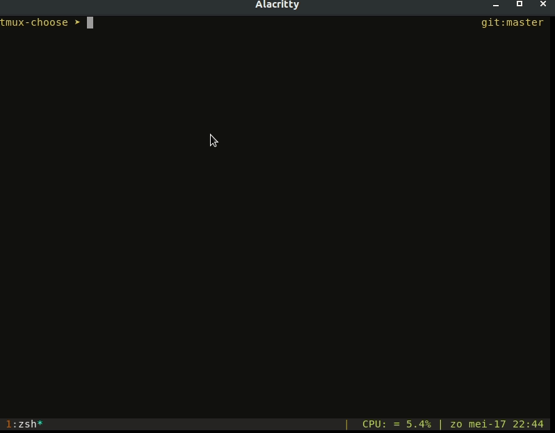

# tmux-choose
**Tmux choose plugin:** Choose which terminal command you want to switch to.

Inspired by tmux-sidebar but I wanted to easily switch to multiple different commands in a separate tmux pane. 

# Usage



Press ( <kbd>prefix</kbd> + <kbd>t</kbd> ) to show the choose menu. 

# Configuration

- @choose-options: Configure which commands should be shown in the choose menu separated by comma.

```
set -g @choose-options "htop,vifm .,lazygit,vi $HOME/.bashrc"

```
- @choose-key: Configure which key to trigger the choose menu.

